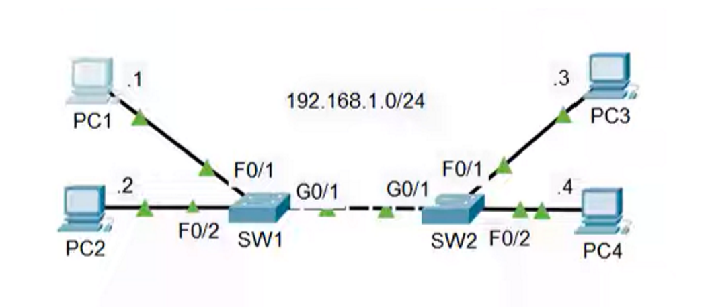

# Lab: Analyzing Ethernet Switching and MAC Address Learning

## Objective
Understand how Ethernet switches learn MAC addresses, forward frames, and handle unknown destinations. Observe the impact of pings on switch MAC tables.

---

## Topology
- **Subnet:** 192.168.1.0/24
- **Devices:**
  - PC1: 192.168.1.1
  - PC2: 192.168.1.2
  - PC3: 192.168.1.3
  - PC4: 192.168.1.4
- **Switches:**
  - SW1: F0/1 → PC1, F0/2 → PC2, G0/1 → SW2
  - SW2: F0/1 → PC3, F0/2 → PC4, G0/1 → SW1

*All switches initially have empty MAC tables. All PCs have empty ARP tables.*
To configure The network devices on the Packet tracer
i. Assign IP address to a PC using Terminal (Command Prompt) In Packet Tracer:
📍 PC → Desktop → Command Prompt

    - ipconfig /ip <IP-address> <Subnet-mask> <Default-gateway>
    - ipconfig /ip 192.168.1.10 255.255.255.0 192.168.1.1

    PC1- ipconfig /ip 192.168.1.1 255.255.255.0
    PC2- ipconfig /ip 192.168.1.2 255.255.255.0
    PC3- ipconfig /ip 192.168.1.3 255.255.255.0
    PC4- ipconfig /ip 192.168.1.4 255.255.255.0


Verify -----Click PC--->Go to Desktop → Command Prompt
    - ipconfig


We don't have Router in our Network, but if have a router in our network here is how to configure it.
    Router – Assign IP Address to Interface
        - Interface: GigabitEthernet0/0
        - enable
        - configure terminal
        - interface gigabitEthernet0/0
        - ip address 192.168.1.1 255.255.255.0
        -  no shutdown
        - exit

Verify
      - show ip interface brief


---

## Tasks

### 1. Predict network behavior by Doing the following tasks
Q-1  PC1 pings to PC3 what messages will be sent over the network and which devices will receive them? 
Q-2 Send the ping and use Packet Tracer's simulation to verify your answers.

Q-3 Use pings to generate network traffic and allow the switches to learn the swiches to learn MAC addresses of all PCs on the network.

Q-4 Use 'show' commands on the switches to identify the MAC address of each PC.

Q-5 Clear the dynamic MAC addresses from the MAC address table of each switch.


### 2. Simulate ping in Packet Tracer
- Use **Simulation Mode**
- Observe ARP requests/replies
- Observe frame forwarding behavior
- Note the learning process of MAC tables

Answers for Q-1, Q-2, Q-3, Q-4 and Q-5

-  Expected behavior:
 Q-1. PC1 pings PC3 what messages will be sent over the network and which devices will receive them? 

ANSWER- while ping message sent from PC1 to PC3 the following steps will happen  
STEPS
i. ARP Request(received by PC2, PC3, PC4)
    - PC1 sends ARP request to find PC3’s MAC address → broadcast on SW1
    - SW1 floods the frame to all ports except incoming (F0/1) 
    - Frame reaches SW2 → SW2 floods to all ports except incoming (G0/1)
    - All the PCs(PC2,PC3,PC4) will receive the ARP Request from PC1
ii. ARP Reply from PC3(received by PC1) and PC1 will add PC3 MAC address to its ARP table.
iii. ICMP Echo Request from PC1 (received by PC3)-this unicas message
iv. ICMP Echo Reply (received by PC1)- this is also a unicast message.


Q-2 Send the ping and use Packet Tracer's simulation to verify your answers.
 - On Packet tracer- click on PC1 and Go to Desktop → Command Prompt 
 - use command 
    - ping 192.168.1.3
    - on packet tracer simulation you can see detail information about the ARP messages both OSI model and PDU detail information at the device.
            - OSI model layers information from Layer 7 down to Layer 1.
            - PDU details which includes    

                1️⃣ PREAMBLE – 7 bytes
                    -Purpose: Synchronizes sender and receiver clocks
                    -Content: Alternating pattern of 10101010 repeated 7 times
                    - Size: 7 bytes (56 bits)
                    - Function: Lets the receiving NIC know a frame is coming and when to start reading it.                

                2️⃣ SFD (Start Frame Delimiter) – 1 byte
                    - Purpose: Marks the start of the actual Ethernet frame
                    - Content: 10101011
                    - Function: Tells the receiver: "Now the next bits are the destination MAC address."

                3️⃣ DEST ADDR (Destination MAC Address) – 6 bytes
                    - Purpose: Specifies the target device’s MAC address
                    - Broadcast example: FF:FF:FF:FF:FF:FF
                    - Means all devices on the LAN should process this frame
                    - Function: NIC checks if its own MAC matches the destination; if yes → process frame

                4️⃣ SRC ADDR (Source MAC Address) – 6 bytes
                    - Purpose: Contains the sender’s MAC address
                    - Function: Lets the receiver know who sent the frame
                    - Used in: ARP replies, learning in switches, etc.

                5️⃣ TYPE (EtherType) – 2 bytes

                    Purpose: Indicates what protocol is in the payload
                    Common values:
                    0x0800 → IPv4
                    0x0806 → ARP
                    0x86DD → IPv6
                    Function: NIC forwards payload to the correct protocol handler

                6️⃣ DATA / PAYLOAD – 46 to 1500 bytes

                    Purpose: Contains the actual data being transmitted
                    Minimum size: 46 bytes (if smaller, padding is added)
                    Maximum size: 1500 bytes (standard Ethernet MTU)
                    Function: Carries IP packets, ARP messages, or other higher-layer protocol data

                 7️⃣ FCS (Frame Check Sequence) – 4 bytes
                    - Purpose: Error detection
                    - Function:
                    - Sender calculates a CRC (Cyclic Redundancy Check) value for the frame
                    - Receiver recalculates CRC and compares with FCS
                    - If different → frame is discarded
            
Q-3 Use pings to generate network traffic and allow the switches to learn the swiches to learn MAC addresses of all PCs on the network.
   • Ping from PC2  to PC4
  

Q-4 Use 'show' commands on the switches to identify the MAC address of each PC.
   - Go to SW1 and SW2 and 
        1. go to previlage EXC Mode by using this command
            - enable
        2. run this command to see the MAC address.
            - Show mac address-table

Q-5 Clear the dynamic MAC addresses from the MAC address table of each switch.
        • Go to SW1 and  SW2 and use this command to clear the MAC addresses from both the switchs
            - Clear mac address-table dynamic
        - To check wheather it is cleared or not use this command
            - show mac address-table
        - You should see a table with no row.
    

### 3. Generate traffic to populate MAC tables
- Send multiple pings between all PCs
- Verify that SW1 and SW2 learn all MAC addresses

### 4. Verify MAC addresses
- On switches, use:
```bash
show mac address-table
