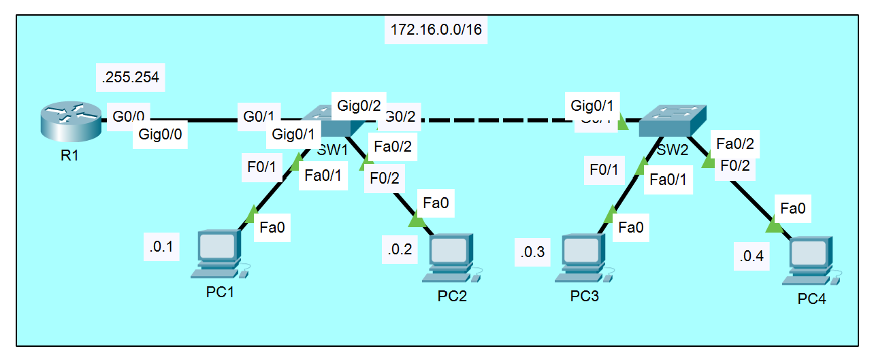

## Overview

This lab provides practical hands-on experience with the concepts covered in Day 8 and Day 9. You'll configure IPv4 addresses on router interfaces, set speed and duplex on switch interfaces, add descriptions, and configure IP addresses on PCs.

## Lab Topology

The lab includes:

- **R1:** Router with multiple interfaces
- **SW1:** Switch connecting to R1 and PCs
- **SW2:** Switch connecting to R1 and PCs
- **PC1, PC2, PC3, PC4:** End devices

## Tasks
Q1. Configure the hostname of R1, SW1, and SW2

Q2. Configure the appropriate IP addresses on R1, PC1, PC2, PC3, PC4

Q3. Manually configure the speed and duplex on interfaces connected to other networking devices (not end hosts)

Q4. Configure appropriate descriptions on each interface

Q5. Disable interfaces which are not connected to other devices.

### Objectives

- Configure IPv4 addresses on router interfaces
- Add interface descriptions
- Enable interfaces

### Configuration Steps

**Enter privileged EXEC mode:**

Router> enable
Router#

Enter global configuration mode:
Router# configure terminal
Router(config)# hostname R1

This will configure hostname to R1 for Router 1, follow the same step for changing host name for SW1 and SW2.

After getting in to global configuration mode, it is possible to configure interfaces as shown below.

Configure GigabitEthernet 0/0:

Router(config)# interface gigabitethernet0/0
Router(config-if)# ip address 172.16.255.254 255.255.0.0
Router(config-if)# description ## to SW1 ##
Router(config-if)# no shutdown
Router(config-if)# exit

Router(config)# end
Router# write memory

or
Router# copy running-config startup-config

Verification Commands
Check interface status:
Router# show ip interface brief
​
View interface details:
Router# show interfaces description
​
Verify specific interface:
Router# show interfaces gigabitethernet0/0

PCs use:

PC1 = 172.16.0.1

PC2 = 172.16.0.2

PC3 = 172.16.0.3

PC4 = 172.16.0.4

Router is using the last usable IP in the /16 range as the default gateway:

Range: 172.16.0.1 → 172.16.255.254

Broadcast: 172.16.255.255

So R1 = 172.16.255.254/16 is acting as the gateway for all PCs.

PC1 Configuration
IP Address: 172.16.0.1
Subnet Mask: 255.255.0.0
Default Gateway: 172.16.255.254

PC2 Configuration
IP Address: 172.16.0.2
Subnet Mask: 255.255.0.0
Default Gateway: 172.16.255.254

PC3 Configuration
IP Address: 172.16.0.3
Subnet Mask: 255.255.0.0
Default Gateway: 172.16.255.254

PC4 Configuration
IP Address: 172.16.0.4
Subnet Mask: 255.255.0.0
Default Gateway: 172.16.255.254

How to Configure PCs in Packet Tracer
Click on the PC
Go to Desktop tab
Click IP Configuration
Select Static
Enter the IP address, subnet mask, and default gateway
Close the window

Testing Connectivity
Ping from PC to gateway:
PC> ping 172.16.255.254
​
Ping from PC to another PC:
PC> ping 172.16.0.4
​
SW1 Configuration
Objectives
Configure interface speed and duplex
Add interface descriptions
Configure management interface (SVI)
Configuration Steps
Enter privileged EXEC mode:
Switch> enable
Switch#
​
Enter global configuration mode:
Switch# configure terminal
Switch(config)#
​
Configure interface to R1:
Switch(config)# interface gigabitethernet0/1
Switch(config-if)# description ## to R1 ##
Switch(config-if)# speed 1000
Switch(config-if)# duplex full
Switch(config-if)# exit
​
Configure interfaces to PCs using range:
Switch(config)# interface range fastethernet0/1-2
Switch(config-if-range)# description ## to PCs ##
Switch(config-if-range)# speed 100
Switch(config-if-range)# duplex full
Switch(config-if-range)# exit

Configure management VLAN interface (optional):
Switch(config)# interface vlan1
Switch(config-if)# ip address 10.0.0.10 255.255.255.0
Switch(config-if)# no shutdown
Switch(config-if)# exit

Exit & Save
Switch(config)# end
Switch# write memory

Verification Commands
Check interface status:
Switch# show interfaces status
​
View interface descriptions:
Switch# show interfaces description
​
Check IP configuration:

## Key Concepts Practiced

### Router Configuration

✓ Assigning IPv4 addresses to router interfaces

✓ Using correct subnet masks

✓ Adding meaningful interface descriptions

✓ Enabling interfaces with no shutdown command

✓ Verifying configuration with show commands

### Switch Configuration

✓ Configuring interface speed manually

✓ Setting duplex mode to full

✓ Using interface range command for efficiency

✓ Adding descriptions to switch interfaces

✓ Configuring switch management interfaces (SVIs)

### PC Configuration

✓ Setting static IP addresses on end devices

✓ Configuring subnet masks

✓ Setting default gateway

✓ Testing connectivity with ping

---

## Important Notes

### Router Interfaces

- Router interfaces are **administratively down by default**
- Always use **no shutdown** command to enable them
- IP address is required for router interfaces to function at Layer 3
- Descriptions help with documentation and troubleshooting

### Switch Interfaces

- Switch interfaces are **up by default** (no shutdown not required, but doesn't hurt)
- Speed and duplex can be manually configured or left to auto-negotiate
- Best practice: use auto-negotiation unless there's a specific reason not to
- Use **interface range** command to configure multiple ports at once

### Saving Configuration

- **write memory** or **copy running-config startup-config** saves configuration
- Without saving, configuration is lost on reboot
- Running-config: currently active configuration
- Startup-config: configuration loaded at boot